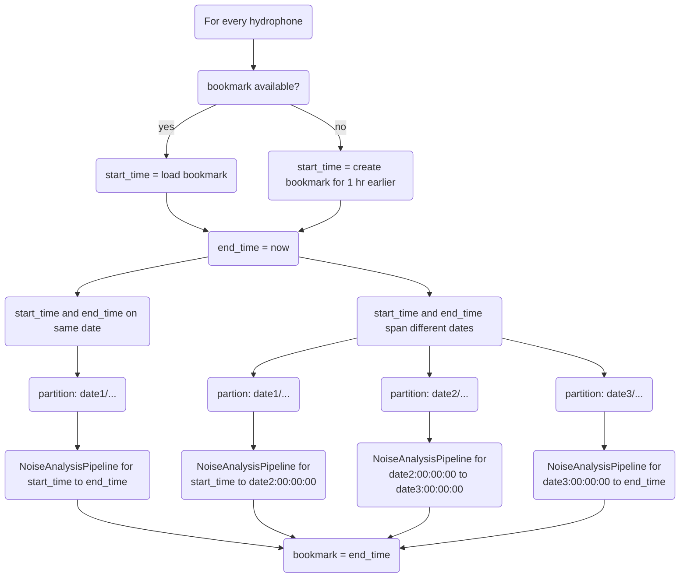

# Github Actions automated pipeline for sound file to Power Spectral Density (PSD) parquet files

## Purpose

The purpose of this github actions workflow is to asyncronously automate the processing of .ts sound files into a PSD parquet dataframe and publish the parquet files to an S3 bucket. The store of a PSD dataframe facilitates retrospective analyses of sound pollution and Orca call signals and their relationships.

## Script/Workflow Features

* Partitioning of parquet file by Hydrophone and date. 
    * ex. data/hydrophone=BUSH_POINT/data=2026-01-16/...
* Bookmarking using a json file uploaded to S3
* File compression of parquet files into single file after one day of records
* CI testing to design for file handling errors

## Script process

## Development TODOs

- ~~Workflow able to save parquet files to repo~~ - 1/14/26
- ~~Bookmarking tentitively working~~ - 1/16/26
- ~~Add functionality to handle two day spans, i.e. time period being processed spans midnight~~ 1/19/26
- ~~Temporary fix for orca-hls-utils errors, using developmental version of orca-hls-utils~~ 1/19/26
- Add metadata generation? (.ts files processed, corresponding time, partial/complete processing of file, file issues)
- Add file compression workflow?
- ~~Add matrix jobs for all hydrophones~~ 1/19/26
- Add publishing to S3